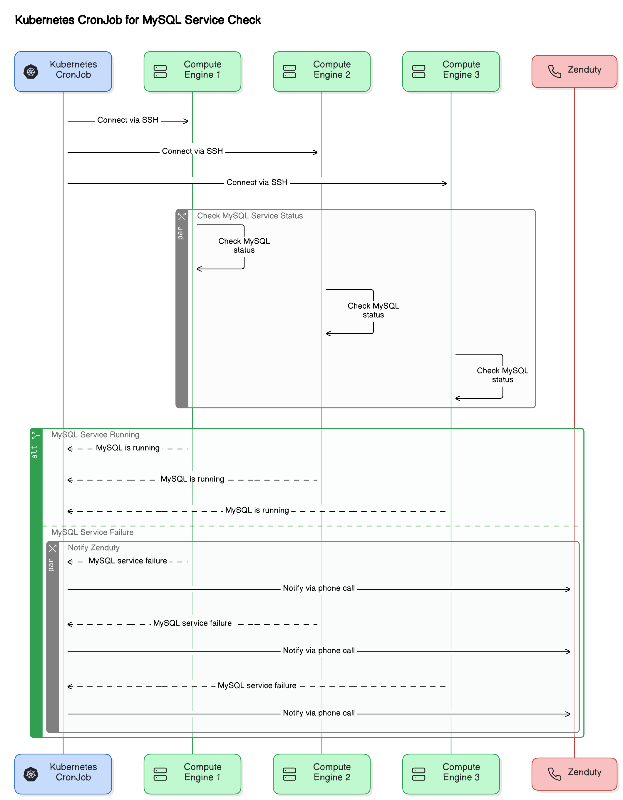

This script will check the mysql service on each mysql servers at regular intervals and will trigger a zenduty call if the service has any other
status like failed, activating, disabled etc.

The private key is added to secret mysql-secret-keys to authenticate cronjob's request to mysql compute engine and public key is added
within allowed ssh keys list of each mysql server compute engine settings.

## Generate SSH keys and use them for authentication instead of passwords.
```
ssh-keygen -t rsa -b 2048 -f ~/.ssh/id_rsa_k8s_cronjob
```
## Add the public key to the Compute Engine instance:
```
gcloud compute instances add-metadata INSTANCE_NAME --metadata-from-file ssh-keys=~/.ssh/id_rsa_k8s_cronjob.pub
```

## Create ssh key secret
```
kubectl create secret generic mysql-secret-keys --from-file=~/.ssh/id_rsa_k8s_cronjob
```

## Create the script configmap

```
kubectl create configmap mysql-monitoring-configmap --from-file=service-monitor-script.sh -n mitesh-test
```

## Create the cronjob with desired schedule
```
kubectl create -f mysql-monitoring-cron.yaml
```

